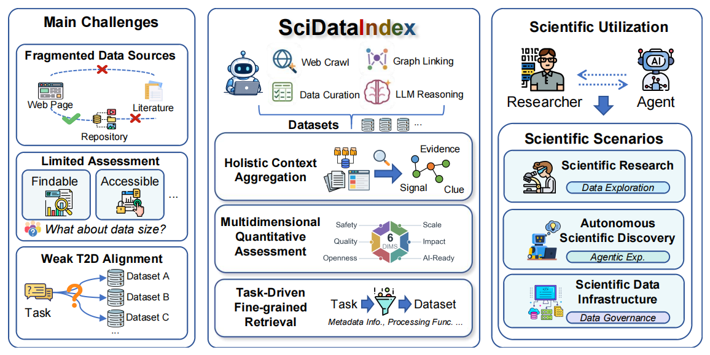
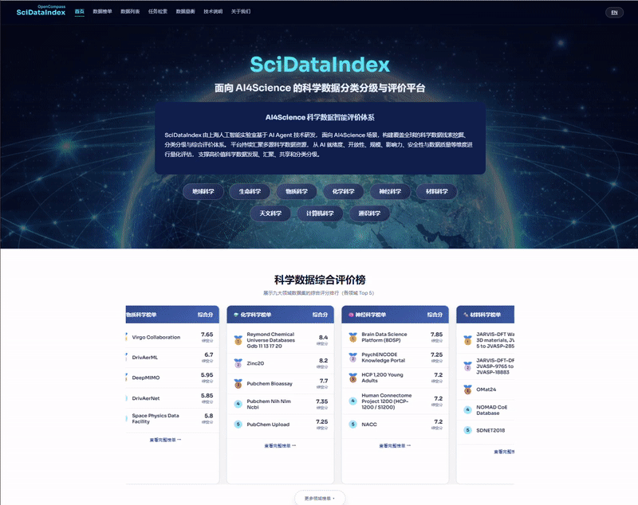
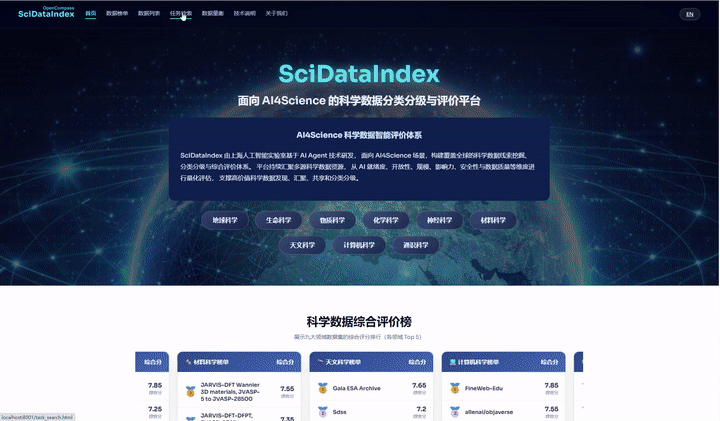
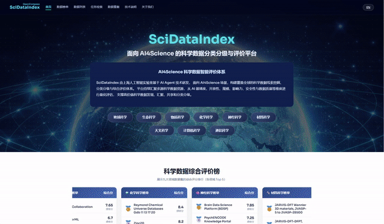

# SciDataIndex

### SciDataIndex: Agent-Driven Scientific Data Infrastructure in the Era of Full-Cycle AI-Native Scientific Research

**面向 AI4Science 场景的科学数据分类分级与智能评价平台**

<!-- 徽章图标 -->

汇聚 **8000+ 科学数据线索** · 覆盖 **九大领域** · **六维量化评估** · 概念图谱智能检索

---

> **SciDataIndex 总览。** 科学数据集散落在世界各地数据仓库中，数据说明不一致、维护状态不明、访问条件各异，研究者难以选型。SciDataIndex 通过持续汇聚全网数据证据、实施多维量化治理、支持任务驱动检索，打通从数据发现到数据选型的闭环，服务 AI 驱动的科学研究。

---

## 📖 平台简介

SciDataIndex 是一个面向科学数据集的**索引、质量评估与智能检索系统**。它回答的核心问题是：

> “我有一个科学问题 / 研究任务，哪些数据集最相关、质量如何、为什么？”

平台覆盖**地球科学、生命科学、物质科学、化学科学、神经科学、材料科学、天文科学、计算机科学、通识科学**九大领域，从 **AI 就绪度、开放性、数据集规模、影响力、安全性、数据质量**六个维度对数据集进行量化评估，支撑高价值科学数据的发现、对比与选型。

---

## ✨ 核心功能

平台围绕三个核心方向提供服务：

### 一、各学科数据集榜单总览

> 入口：首页 / 数据榜单 / 数据列表

- **首页榜单**：九大领域各取综合评分 Top 5 数据集，一行三列自动滚动展示，鼠标悬停暂停；可展开全部九张榜单卡片。
- **数据榜单页**：每个领域独立成页，展示该领域评分最高的前 60 个数据集（优先展示来源/下载链接齐全者，再按综合分排序），分 6 页浏览。
- **数据列表页**：汇总 9 领域共 540 个上榜数据集，支持翻页浏览。
- **数据集详情页**：查看六维评分雷达、数据简介、所属类别、完整性、首次发布、最近更新、来源链接与下载链接（**均经人工审核，带跳转确认**）。

> *九大领域 Top 5 滚动榜单 / 各领域 Top 60 完整榜单浏览，六维评分查看与官方来源溯源。*

### 二、基于概念图谱的数据检索、分析与来源追溯

> 入口：任务检索

- **自然语言检索**：输入研究任务描述（如“我想寻找生命科学数据安全高风险研究相关的数据集”），返回 Top-10 候选数据集，支持开启/关闭精准检索（LLM 重排）。
- **知识图谱可视化**：检索完成后展示候选关系图谱——数据集全局图、单数据集子图（下钻视图）、全局关系图三种视图，支持缩放、全屏查看。
- **智能分析报告**：基于图谱推理结果，由 LLM 生成科学问题、数据关联、研究意义、应用场景四个维度的分析文本，支撑数据集均带超链接可跳转详情页。
- **检索进度透明**：从向量召回、图构建到 LLM 分析，各阶段耗时实时展示。

> *输入自然语言查询，关闭精准检索走向量召回快速粗排，开启精准检索走“语义相似度 + 受控词表”双路召回与知识图谱多跳推理，并展示候选图谱关系、多跳推理过程与重排动画。*

### 三、开放式数据对比与量衡（六维评分对比 + 图谱深度分析）

> 入口：数据量衡

- **双区选集**：左侧「数据集选择区」浏览全库数据集，「检索候选区」接收从任务检索页一键加入的候选（最多 12 条，localStorage 持久保留、跨页面联动）；两区条目均可加入右侧对比列表，实现跨查询数据集对比。
- **六维雷达对比**：最多同时叠加 12 个数据集的六维评分雷达图，右侧列表展示综合评分，支持单条移除、点击名称跳转详情页。
- **深度分析**：将选中的数据集子图合并为候选关系图谱，复用检索端的图推理 + LLM 分析管线，生成知识图谱（全局图/子图下钻/关系图）、数据关联、科学问题、研究意义、应用场景五个板块的分析结果。

> *面向跨查询、跨领域的交叉研究需求，将不同批次检索中感兴趣的数据集汇总对比与关联分析，贴合科研工作者的实际调研思路。（演示为 2 倍速）*

---

## ⚠️ 免责声明

SciDataIndex 引用的科学数据信息均基于互联网智能搜索技术挖掘，评分结论仅供参考。平台将持续迭代数据范围与榜单版本。

---

Built for AI4Science · 让高价值科学数据可发现、可评估、可复用

